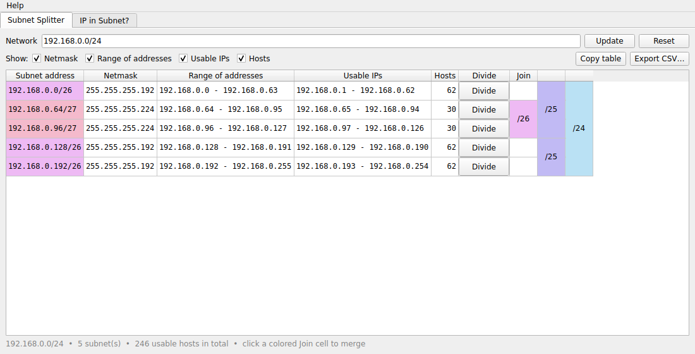
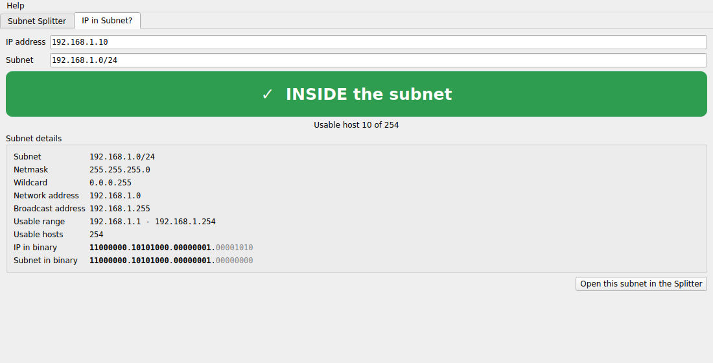
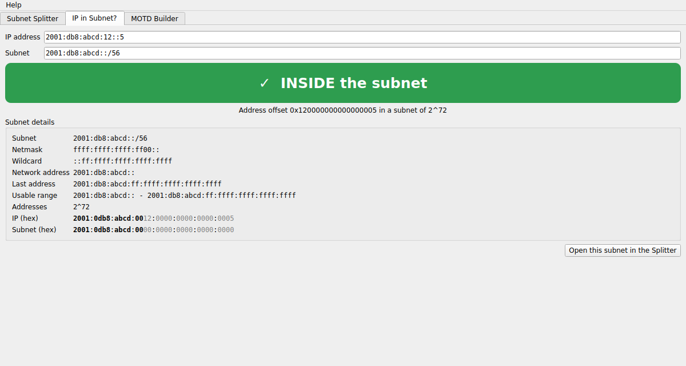
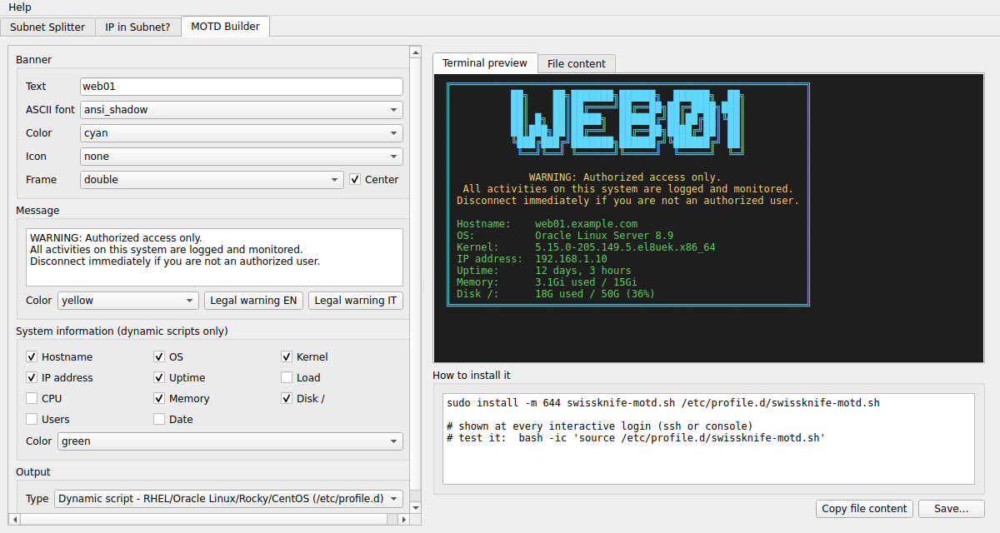

# Sysadmin Swissknife

Small tools for system administrators, as a desktop app for **macOS** and **Windows**:
a visual subnet splitter and an IP-in-subnet check (IPv4 and IPv6), and a MOTD builder
with ASCII-art banners.



## Tools

### Subnet Splitter
A visual IPv4/IPv6 subnet calculator, inspired by the davidc.net *Visual Subnet Calculator*:

- enter a network (`192.168.0.0/24`, `192.168.0.0 255.255.255.0` or `2001:db8::/48`)
- press **Divide** on any row to split it, click a colored **Join** cell to merge it back
- choose how many pieces **Divide** creates: 2, 4, 16 or 256
  (16 = one hex digit, the natural step for IPv6: /48 → /52 → /56 ...)
- every subnet shows netmask, address range, usable IPs and number of hosts
  (/31 and /32 handled as per RFC 3021)
- **Copy table** (ready to paste in Excel/Numbers) or **Export CSV**
- the layout is saved and restored when you reopen the app

### IP in Subnet?


Type an address and a subnet and see immediately if it is **inside** or **outside**:

- warns when the address is the network or broadcast address
- shows the host position, netmask, wildcard, usable range and a binary view where the
  network bits are highlighted
- works with a whole network too (`10.0.0.128/25` inside `10.0.0.0/24`? yes; `10.0.0.0/23`? partially)
- IPv6 too, with a hex view where the network nibbles are highlighted
  and a note for the Subnet-Router anycast address
- one click opens the subnet in the Splitter



### MOTD Builder


Design the login banner of your servers and get the file ready to install:

- ASCII-art banner from text (20 fonts), optional icon, frames (single, rounded, double, ASCII, #),
  ANSI colors, centered layout
- free message with ready-made legal warnings (English / Italian)
- live system information: hostname, OS, kernel, IP, uptime, load, CPU, memory, disk, users, date
- three outputs:
  - **static** `/etc/motd`
  - **Ubuntu/Debian** script for `/etc/update-motd.d/`
  - **RHEL / Oracle Linux / Rocky / CentOS** script for `/etc/profile.d/`
    (runs only for interactive logins, so scp and cron stay silent)
- terminal preview, copy or save, and the exact commands to install it

## Download

From the [latest release](https://github.com/renero82/sysadmin-swissknife/releases/latest):

- **macOS (Apple Silicon)**: `sysadmin-swissknife-vX.Y.Z-macos-arm64.zip` - unzip it and drag
  **Sysadmin Swissknife.app** to Applications
- **Windows**: `sysadmin-swissknife-vX.Y.Z-windows-portable.exe` - a single portable file,
  nothing to install: put it wherever you like and run it

The apps are not signed. On Windows, in the SmartScreen dialog click **More info** →
**Run anyway**. On macOS, the first time right-click the app → **Open** → **Open**;
if macOS says the app is damaged, run once:

```bash
xattr -dr com.apple.quarantine "/Applications/Sysadmin Swissknife.app"
```

## Run from source

```bash
git clone https://github.com/renero82/sysadmin-swissknife.git
cd sysadmin-swissknife
python3 -m venv .venv && source .venv/bin/activate
pip install -r requirements.txt
python3 app.py
```

## Development

```bash
pip install pytest && python -m pytest -q tests     # unit tests of the subnet logic
./scripts/build_macos.sh                             # tests + app build + selftest (macOS)
pyinstaller --noconfirm sysadmin_swissknife.spec     # on Windows: dist\Sysadmin Swissknife.exe
```

Pushing a tag like `v1.1.0` makes GitHub Actions run the tests, build the macOS and Windows apps, run their
`--selftest` and publish the release. The tag must match the version in
`sysadmin_swissknife/__init__.py`.

## License

[MIT](LICENSE)
